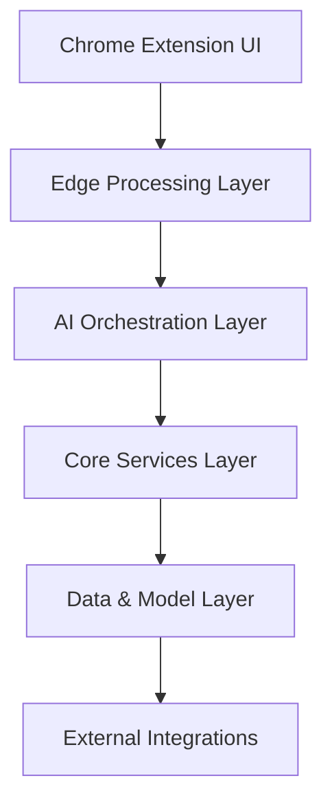
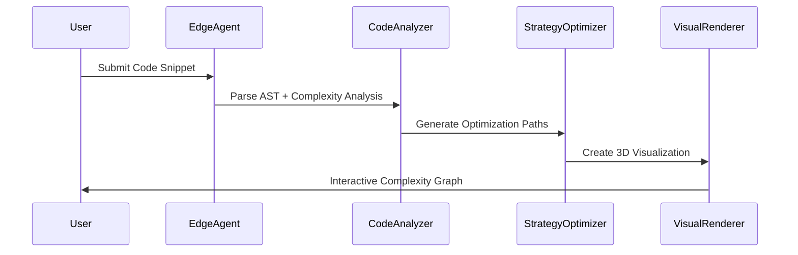
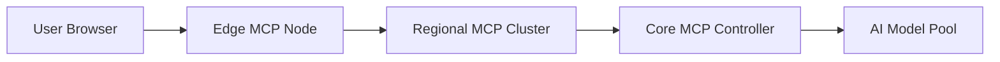

# VibeAlgo AI 

## 1. Executive Summary
Three integrated Chrome extensions combining AI-powered code analysis, DSA mastery tracking, and competitive programming optimization. Built on modern MCP architecture with Groq-accelerated LLMs and real-time visualization.

---

## 2. System Architecture

### 2.1 High-Level Architecture Diagram


### 2.2 Layer Breakdown

**1. Edge Processing Layer (Browser)**
- Real-time code scanning
- DOM analysis engine
- Visualization renderer
- Local cache management

**2. AI Orchestration Layer**
- Agentic workflow controller
- RAG pipeline manager
- Groq API gateway
- MCP protocol adapter

**3. Core Services Layer**
- Code analysis microservice
- Performance predictor
- Strategy optimizer
- User modeling engine

**4. Data & Model Layer**
- ChromaDB vector store
- Algorithm knowledge graph
- Contest history database
- Pre-trained complexity models

---

## 3. Technical Specifications

### 3.1 Tech Stack Matrix

| Component                | Technology Choices                          |
|--------------------------|---------------------------------------------|
| Frontend                 | React + TypeScript + D3.js + Three.js       |
| AI Pipeline              | LangChain + LlamaIndex + Groq API           |
| Vector DB                | ChromaDB + Qdrant                           |
| Visualization            | D3.js + Plotly + WebGL                      |
| Code Analysis            | Tree-sitter + ESLint AST parser             |
| Real-time Comms          | WebSocket + MCP-over-gRPC                   |
| CI/CD                    | GitHub Actions + ArgoCD                     |
| Monitoring               | Prometheus + Grafana + OpenTelemetry        |
| Security                 | CSP3 + OAuth2.1 + WebAuthn                  |

---

## 4. AI Agent Pipeline

### 4.1 Multi-Agent Workflow


### 4.2 Key AI Models
1. **Code Understanding Agent** (Groq-Llama-3-70B)
   - AST pattern recognition
   - Time/space complexity prediction
   
2. **Contest Strategy Agent** (Groq-Mixtral-8x22B)
   - Problem difficulty estimation
   - Time allocation optimizer
   
3. **Progress Modeling Agent** (Fine-tuned CodeLlama)
   - Skill gap analysis
   - Personalized learning path

---

## 5. MCP Server Distribution

### 5.1 Node Architecture


### 5.2 Protocol Implementation
- **MCP Context Channels**
  - code-context/v1
  - dsa-progress/v2
  - contest-strategy/v1
  
- **MCP Services**
  ```proto
  service AlgorithmIntelligence {
    rpc AnalyzeComplexity(CodeSubmission) returns (ComplexityReport) {}
    rpc GenerateStrategy(ContestState) returns (OptimizationPlan) {}
    rpc UpdateProgress(DSAEvent) returns (SkillGraph) {}
  }
  ```

---

## 6. Data Flow & Processing

### 6.1 Real-time Processing Pipeline
1. Code Snapshot Capture (MutationObserver API)
2. AST Parsing & Normalization
3. Vector Embedding Generation
4. RAG Context Retrieval
5. LLM Reasoning & Validation
6. Visualization Data Packaging

### 6.2 Performance Characteristics
- Initial Analysis:  B[JWT Authentication]
    B --> C[WASM Sandbox]
    C --> D[AST Validation Layer]
    D --> E[LLM Output Sanitizer]
```

### 7.2 Key Protections
- Strict CSP policies for extension isolation
- Code execution in WebAssembly sandboxes
- LLM output validation with ReAct framework
- MCP channel encryption with TLS 1.3

---

## 8. Development Roadmap

### Phase 1: Core Infrastructure (6 Weeks)
- Setup MCP protocol servers
- Implement AST parser microservice
- Build basic Chrome extension scaffold
- Integrate ChromaDB knowledge base

### Phase 2: AI Integration (4 Weeks)
- Train complexity prediction model
- Implement RAG pipeline
- Develop strategy optimization logic
- Create visualization components

### Phase 3: Polishing (2 Weeks)
- Performance optimization
- Security audits
- User testing
- Documentation completion

---

## 9. Metrics & Validation

| Metric                  | Target Value           | Measurement Method         |
|-------------------------|------------------------|----------------------------|
| Analysis Accuracy       | 95% vs Human Experts   | LeetCode Hard Problem Set  |
| Visualization FPS       | 60fps @ 4K             | WebGL Benchmark            |
| Cold Start Time         | <1.5s                  | Chrome Performance API      |
| Memory Usage            | <300MB                 | Chrome Task Manager         |
| Security Vulnerabilities| 0 Critical             | OWASP ZAP Scans             |

---

## 10. Contribution Guidelines

### 10.1 Development Setup
```bash
# Clone repo
git clone --recurse-submodules https://github.com/algointel/suite.git

# Install dependencies
npm run bootstrap

# Start dev environment
docker-compose -f dev-stack.yml up
```

### 10.2 Key Directories
```
/src
  /extension - Chrome extension UI
  /services - Microservices
  /models - AI training code
/docs - Architecture diagrams
/test - Cypress + Jest tests
```
